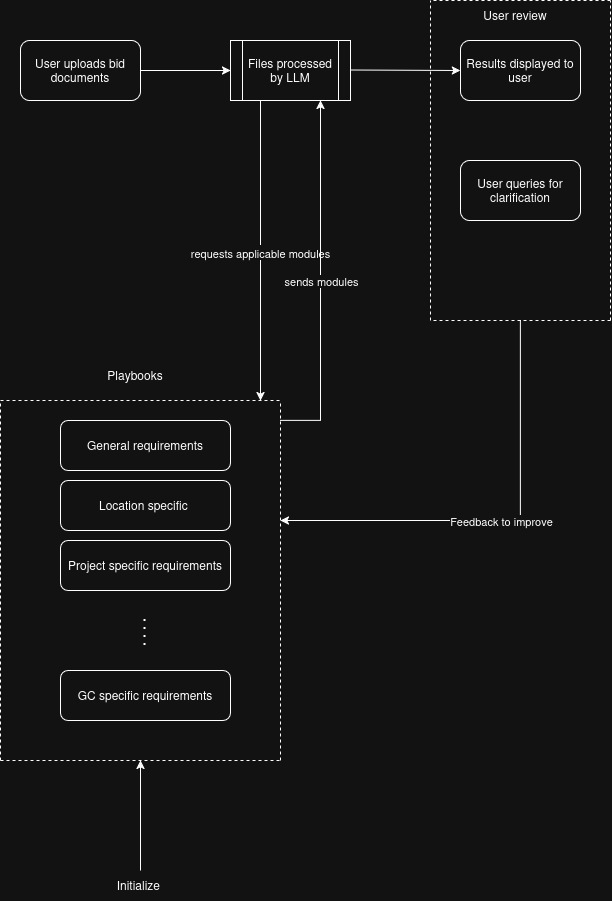

# Construction estimating

*Consistency* and *capacity* are highlighted as the challenges faced by every job function within the construction industry. Companies of all sizes and projects of any complexity are constrained by these challenges.

Construction sector is mirroring a global industrial shift in adopting AI as a catalyst for operational productivity. Integrating AI with a focus on just efficiency would fall short in addressing the consistency issue.
This project is an exploration in designing a system that leverages AI to speed up the estimation process within General Contracting firms, delivers a consistent and verifiable experience to estimators through auditability and control.

Achieving speed can be obvious as AI can compute and process hundreds of pages in bid documents, cross verify between technical specs and construction drawings in minutes compared to what would take hours for humans to do the same. 

For consistent estimates, the way estimation is done has to be repeatable for all projects and across individuals. Usually estimators do the review based on their thinking or through basic checklists which produces variations. AI can be used to create/document playbooks (SOPs, bid protocols etc), which can then be applied in an automated fashion for all projects and thus delivering consistency.  Playbooks need to be exhaustive, tuned to project types, evolve as needed over time. System can make playbook creation and maintenance seamless by leveraging feedback from workflows and usage patterns.

When the estimate results are presented to the user for review, the information has to be clear and concise. Each output statement in the result must be verifiable with citations.

## 🎯 Project focus

Estimators perform many tasks in their job: Bid review, risk assessment, takeoff, division breakdown, gap analysis, sub trade solicitation, scope leveling, direct and indirect costing, etc. 

System architecture has to scale across these tasks. For base case, design of the system will focus on bid review and risk assessment with a view to accommodate the other tasks in the later phases.

## 🖥️ System approach 

###### Playbooks
These are modular blocks representing SoPs. The intent is to have comprehensive SoPs for all kind of projects dealt by GC estimators.

For e.g., General requirements would comprise of things to callout in general such as work hour restrictions, site access, hoarding/protection requirments.

Location specific module would deal with municipal/local permits, Ontario building codes or building specific constraints such as mall, warehouse etc.

Project specific requirements are requirements that are only relevant for specific type of project. Retail shop fitout project has to deal with specialty lighting, glazing related requirements. Office fitout project may have to deal with IT/AV/security scope, electrical/bandwidth needs. Medical clinic fitout has to take care of gas plumbing, infection control requirements etc.

###### Process
When bid files are uploaded, appropriate section need to be identified and extracted. Right project type classification has to be done. Then pull the playbook modules relevant for the project type and complete the processing. LLMs are leveraged in all of these steps to finally produce a report for review by the user.

###### Feedback
The actions of the user during the review might bring up the need to add/improve/correct the playbooks. Feedback mechanism will be enabled to handle those.  

### 📋 Workflows  

#### Bid or No Bid review
This is usually a quick review by the estimator on a high level to check if the bid can be considered for submission based on its fit. Estimator might just check general requirements, project schedule/timeline, bonding/insurance requirements.

This workflow might be beneficial to the user, if the quick review happens based on events rather than user manually uploading. 

Check the [example](https://project-uc70h.vercel.app/reports/prj1.html) 
[To do] - citations to include the image of relevant section from the source file

#### Bid full review
This is the workflow that follows after 'Go' bid submission review. All relevant risks, scope gaps and issues should be surfaced in this workflow.

Check the [example](https://project-uc70h.vercel.app/reports/prj2.html) 
[To do] - citations to include the image of relevant section from the source file
